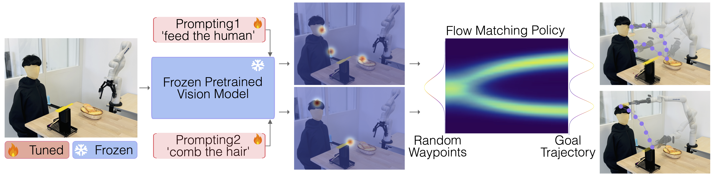
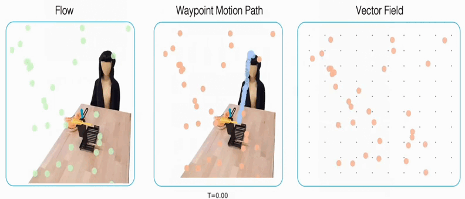

# Flow-Latent MPC: Safe Generative Robotic Planning via World Models

<div align="center">
  
  <p><i>Original inspiration and Flow Matching foundation by Zhang & Gienger, Honda Research Institute EU. Our framework replaces 2D affordances with Latent World Model verification for 3D physics-aware planning.</i></p>
</div>

Welcome to the official repository for **Flow-Latent MPC**. This project introduces a state-of-the-art "Propose & Verify" architecture for robotic continuous control, marrying the lightning-fast generative capabilities of **Flow Matching** with the physical foresight of **Latent World Models (V-JEPA & DINOv2)**.

📖 **For a complete mathematical breakdown and file-by-file system guide, please see our [Architecture Guide](Architecture_Guide.md).**

## 📖 The Story: Why, What, and How

### The Problem (Why)
Standard imitation learning in robotics is inherently **reactive**. A robot looks at a camera frame and blindly predicts the next motor command. While recent breakthroughs in Generative Policies (like Diffusion or Flow Matching) allow robots to model highly complex, multi-modal actions, they still suffer from "blind execution." 

If a generative policy is thrown into an out-of-distribution (OOD) scenario, it might confidently generate a trajectory that smashes the robot arm through a table. Previous work (like the Honda Research Institute paper we build upon) utilized 2D visual "affordances" to tell the robot *where* to act. However, 2D heatmaps lack strict 3D physical constraints. **An affordance tells a robot where to look, but a World Model tells a robot what happens if it acts.**

### Our Approach (What)
We introduce **Flow-Latent Model Predictive Control (MPC)**. Instead of blindly executing generative outputs, we shift to a **predictive, temporally-smoothed policy**:
1. **Propose:** A Flow Matching policy instantly generates $N=16$ diverse, physically plausible candidate trajectories.
2. **Verify:** A Latent World Model "imagines" the physical consequences of all 16 trajectories in a compressed 3D-aware latent space.
3. **Execute:** The planner evaluates these imagined futures against the goal, selects the safest path, and executes a smooth chunk of actions to eliminate kinematic jitter.

### The Engine (How)

<div align="center">
  
  <p><i>Visualization of the Flow Matching ODE vector field. (Credit: Honda Research Institute)</i></p>
</div>

To achieve real-time (20Hz+) closed-loop control without memory overflow, our architecture leverages three highly optimized engines:
1. **Generative Prior (Flow Matching):** We replace slow stochastic diffusion (SDEs) with deterministic Ordinary Differential Equations (ODEs). This allows us to generate 16 candidate trajectories from pure Gaussian noise in just 4 Euler steps.
2. **Spatial Perception (DINOv2):** We encode simulator images into a rich, 256-patch spatial grid using Meta's frozen `dinov2_vitl14` foundation model.
3. **Latent Physics (V-JEPA-2-AC):** We utilize Meta's Action-Conditioned World Model (trained on the massive DROID dataset) to roll out future spatial states conditioned on the Flow Matcher's 7D motor proposals. 

## 🛠️ Repository Structure

```text
flow-latentWM-mpc/
│
├── data/
│   └── robomimic_dataset.py      # Sliding-window dataset loader
│
├── models/
│   ├── flow_matching.py          # The Proposer: ODE Flow Matching Mathematics
│   ├── planner.py                # The Brain: Latent MPC, Cost Evaluation & Action Chunking
│   ├── unet.py                   # 1D Conditional U-Net for ODE Flow (FiLM conditioned)
│   └── world_model.py            # The Verifier: DINOv2 Encoder + V-JEPA Predictor
│
├── scripts/
│   ├── evaluate_flow.py          # Plots multi-modal generative trajectory proposals
│   ├── evaluate_robomimic.py     # Headless MuJoCo evaluation & video rendering
│   ├── extract_goal.py           # Extracts the success frame from human demonstrations
│   └── train_flow.py             # Behavioral Cloning training loop for the U-Net
│
├── Architecture_Guide.md         # Detailed mathematical and codebase documentation
├── download_real_data.py         # Automated Hugging Face mirror downloader
├── README.md                     # Project story, credits, and setup guide
└── requirements.txt              # Minimal project dependencies
```

## Quick Start

**1. Install Dependencies**
We recommend using a conda environment with Python 3.10.
```bash
conda create -n flowwm_mpc python=3.10 -y
conda activate flowwm_mpc
conda install pytorch torchvision torchaudio pytorch-cuda=11.8 -c pytorch -c nvidia
pip install -r requirements.txt
```

**2. Download the Robomimic Dataset**
Download the Proficient Human (`ph`) Lift dataset into the `data/` folder.
```bash
python download_real_data.py
```

**3. Train the Flow Matcher**
Train the generative ODE prior on the 7D robot demonstrations. Action normalization is handled automatically.
```bash
python scripts/train_flow.py
```

**4. Evaluate in MuJoCo**
Launch the headless simulator. The script will automatically download the V-JEPA and DINOv2 weights from PyTorch Hub/Hugging Face, run the Propose & Verify MPC loop, and save a high-quality `.mp4` video to the `videos/` folder.
```bash
python scripts/evaluate_robomimic.py
```

## 🙏 Acknowledgements and Credits

This research builds upon the incredible open-source contributions of several labs:

* **Flow Matching & Conceptual Inspiration:** The base generative architecture, `ConditionalUnet1D` backbone, and explanatory graphics (`images/overall.png`, `images/flow.gif`) are credited to the foundational work by Fan Zhang and Michael Gienger at the **Honda Research Institute EU**: *"Affordance-based Robot Manipulation with Flow Matching"*.
* **World Models & Foundation Models:** The Latent WAM verifier utilizes the `V-JEPA-2-AC` and `DINOv2` architectures provided by **Meta FAIR**. 
* **Simulation & Data:** Physical evaluation and expert demonstration datasets are provided by the **Robosuite** and **Robomimic** frameworks (Stanford Vision and Learning Lab / UT Austin).